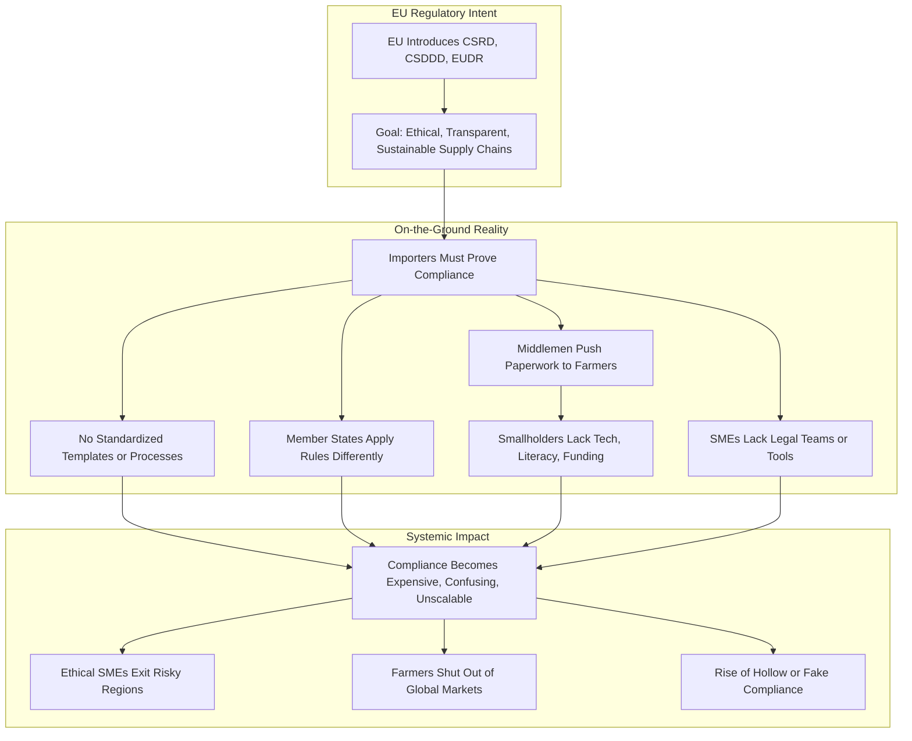
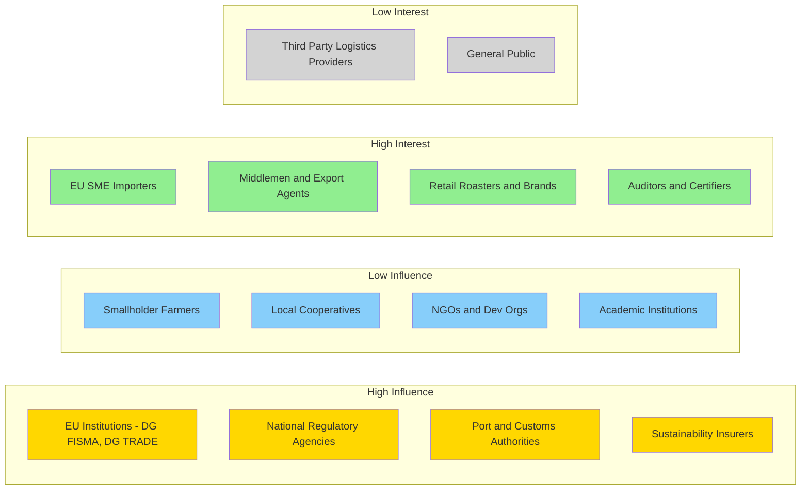
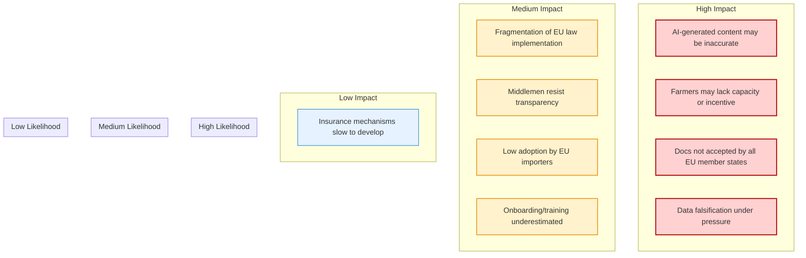

# 📄 Project Proposal: [ClearRoots Assurance]

## 🧭 Project Title
ClearRoots Assurance


## 🔍 Executive Summary
[Brief overview: what the project is, the problem it solves, who it's for, and what makes it unique.]

---

## 🎯 Objectives

- **Automate Compliance Documentation for SMEs and Importers**  
  Design and deploy an AI-supported tool that generates EU-compliant sustainability documentation (CSRD, CSDDD, EUDR) for SME importers and their suppliers, reducing manual input time by at least 50% within 12 months.

- **Alleviate Paperwork Burden on Smallholder Farmers**  
  Provide mobile-friendly interfaces that help smallholder farmers contribute the necessary data for compliance, even in low-connectivity and low-literacy settings, reaching at least 1,000 farmers in the first pilot year.

- **Demonstrate a Business Case for Inclusive Sustainability**  
  Produce measurable case studies showing that automating compliance processes can reduce administrative costs for SME importers while enabling continued sourcing from high-risk, low-infrastructure regions — published by end of Year 1.

- **Reduce Compliance Risk for EU Buyers Through Assurance**  
  Launch a pilot assurance service that packages verified compliance data into auditable reports, reducing legal and reputational risk for at least 5 SME coffee importers by Q2 2026.


---

## 🚨 Problem Statement

The EU’s new sustainability regulations — CSDDD, CSRD, and EUDR — are designed to protect the planet and uphold human rights. But for smallholder farmers and SME importers, these laws have become a bureaucratic trap.

On paper, EU companies are now legally required to prove that their supply chains are free from deforestation, labor abuse, and unsustainable practices. In reality, the compliance infrastructure to make that possible — especially at the beginning of the chain — simply does not exist.

There is **no standard template for what a compliant import document looks like**. Every member state implements the rules differently. Regulatory text offers principles, not formats. The burden of proof lies with buyers and farmers — yet neither is equipped to meet it.

Meanwhile, smallholder farmers in Africa — who produce over 70% of the continent’s coffee — are being asked to prove things that are not only hard to document, but often conceptually mismatched with their reality. These farms are typically:
- **Run by families**, not formal employees
- **Unregistered**, without tax IDs or digital infrastructure
- **Cash-based**, without formal banking or payroll systems
- **Low-income**, with no spare budget for lawyers, audits, or compliance officers

Most farmers don’t speak the language of the law. Many don’t have electricity, internet access, or even printers. And they certainly don’t have the money to hire someone who can fill out EU-aligned compliance paperwork.

To make matters worse, **middlemen and traders frequently place the burden squarely on the farmer**, stating outright that unless these documents are provided, they will not buy the goods. This shifts the entire compliance workload to the beginning of the chain — the point where capacity is lowest and support is nearly nonexistent.

EU importers, especially SMEs, are caught in the middle.  
- If they source from smallholders, they risk **fines or reputational damage** for not being able to prove compliance.  
- If they walk away, they abandon ethical supply chains and drive more families into poverty.  
- If they fake it, they perpetuate a growing system of **hollow compliance** — where paperwork is manufactured to pass audits, not reflect reality.

The result is a **perverse system**:
- Doing the right thing costs more than appearing compliant.
- Large corporations with compliance teams and legal buffers dominate.
- Smallholders and honest SMEs are pushed out of markets for **lack of documentation**, not lack of ethics.

This creates a dangerous **compliance gap**:
- No scalable tools exist to help smallholders and SMEs generate trustworthy, auditable compliance documents.
- No shared verification frameworks exist that make that proof defensible to regulators.
- No affordable assurance mechanisms exist to protect EU buyers acting in good faith.

Unless this gap is closed, the EU’s sustainability agenda will backfire — **deepening inequality, incentivizing fraud, and rewarding scale over substance**.

ClearRoots exists to change that — using AI, automation, and real data — starting with coffee, and starting now.



## 🌍 Target Audience

### 🎯 Primary Audiences

- **EU SME Coffee Importers (5–250 employees)**  
  These businesses source from African cooperatives but lack legal, compliance, or ESG teams.  
  📌 *Pain:* They must provide traceable, auditable documents or risk fines, exclusion, or reputational loss — but cannot afford complex compliance systems.  
  ✅ *ClearRoots offers:* Low-cost, plug-and-play tools for due diligence documentation that hold up to audits and reduce operational burden.

- **Smallholder Farming Cooperatives in Central Africa**  
  Often family-run, cash-based, and informally structured, these cooperatives cannot meet the paper demands of EU law without external support.  
  📌 *Pain:* They risk being excluded from markets simply for lacking printers, payrolls, or fluency in EU regulatory terms.  
  ✅ *ClearRoots offers:* Multilingual, mobile-first tools that translate practice into proof — even without literacy, internet, or formal records.

- **Export Agents and Middlemen**  
  These actors control access to markets and often act as compliance enforcers, demanding documents from cooperatives.  
  📌 *Pain:* They have no consistent format or tool to collect, verify, or transmit compliance data.  
  ✅ *ClearRoots offers:* A common system they can use to verify and forward compliant batches without relying on informal PDFs or emails.

- **Retail Coffee Brands and Roasters (SME to mid-size)**  
  While not directly importing, these actors face pressure from consumers, investors, and regulators to demonstrate ethical sourcing.  
  📌 *Pain:* They depend on fragmented supply chain data and lack a clear audit trail.  
  ✅ *ClearRoots offers:* Verified, branded sustainability documentation to strengthen consumer trust and reduce ESG reporting risk.

### 🧩 Secondary Audiences

- **EU Institutions and Directorates (e.g., DG FISMA, DG TRADE, DG ENV)**  
  📌 *Pain:* EU regulation is being implemented without operational clarity or field-based feedback, increasing the risk of policy failure.  
  ✅ *ClearRoots offers:* A field-tested model for due diligence documentation, ready to inform template standardization and implementation guides.

- **National Regulatory Agencies in EU Member States**  
  📌 *Pain:* Each state interprets CSDDD/CSRD compliance differently, leading to fragmentation and enforcement inconsistency.  
  ✅ *ClearRoots offers:* Template-aligned documents that could reduce ambiguity and lower the enforcement burden.

- **Sustainability Certifiers and Auditors (e.g., Rainforest Alliance, Ecocert)**  
  📌 *Pain:* Reviewing unstructured, unverifiable compliance data is time-consuming and inconsistent.  
  ✅ *ClearRoots offers:* A standardized, digital dossier system that accelerates audit cycles and improves traceability confidence.

- **Third-Party Logistics Providers (3PLs)**  
  📌 *Pain:* They often move product but don’t have traceable access to origin-level compliance documents.  
  ✅ *ClearRoots offers:* A way to integrate compliance verification into the physical movement of goods.

- **Sustainability Insurers and ESG Investors**  
  📌 *Pain:* No insurable, verifiable ESG baseline exists for smallholder sourcing.  
  ✅ *ClearRoots offers:* Trusted data that enables compliance-backed risk products and impact-linked funding models.

- **NGOs and Development Organizations**  
  📌 *Pain:* Support smallholders on livelihoods, but lack tools to help them meet evolving legal trade standards.  
  ✅ *ClearRoots offers:* A free or subsidized toolset they can distribute to build legal, market, and financial inclusion.

- **Academic Institutions (e.g., Windesheim UAS, SCF Nice)**  
  📌 *Pain:* Need applied research opportunities that engage EU law, supply chain digitalization, and rural equity.  
  ✅ *ClearRoots offers:* A scalable research and impact platform with policy relevance and implementation potential.

- **National Port and Customs Authorities (EU Member States)**  
  📌 *Pain:* Tasked with verifying incoming goods meet sustainability and due diligence requirements, but face inconsistent paperwork formats, unverifiable claims, and rising audit complexity — especially for high-risk commodities like coffee, cocoa, and timber.  
  ✅ *ClearRoots offers:* A standardized, digital compliance dossier that aligns with EU legal requirements and provides traceability from first mile to point of entry — streamlining customs review and reducing risk of wrongful clearance or delays.



## 💡 Proposed Solution

ClearRoots is a compliance and assurance platform designed to help smallholder cooperatives and EU SME importers meet the requirements of EU sustainability regulations (CSDDD, CSRD, EUDR). The system supports structured, field-based data collection, and provides verifiable documentation — with AI used only to assist or infer information when it can be backed by traceable data.

The solution comprises four core components:


### 1. Structured Compliance Documentation Engine with AI Support

ClearRoots includes a modular, regulation-aligned documentation engine that enables cooperatives and importers to generate audit-ready EU compliance reports using structured inputs.

Key features:
- Predefined templates for due diligence, traceability, and deforestation declarations aligned to CSRD, CSDDD, and EUDR
- Multilingual input support, voice-to-text, and contextual help to increase accessibility for low-literacy users
- **AI-assisted field guidance** (e.g., translations, explanations, tooltips) for navigating complex documentation

Where farmers cannot reasonably provide the required documentation (e.g., exact land boundaries, harvest estimates), the system can:
- Use blockchain transaction history (timestamps, GPS)
- Leverage satellite imagery or geo-tagged records
- Apply AI inference to fill in **structured fields** such as harvest windows, field size, or supply volumes

All AI-inferred fields are **explicitly flagged** and auditable via linked source data, ensuring full transparency and legal traceability.


### 2. Mobile-First Data Capture and Submission

A mobile application enables cooperatives to capture regulatory data directly in the field without needing external consultants or printed forms.

Key capabilities:
- Offline-first operation with syncing when network is available
- Image capture, GPS tagging, and timestamping for each submission
- Cooperative-level validation of entries before submission

This approach decentralizes compliance preparation and avoids dependency on middlemen or exporters.


### 3. Blockchain-Based Data Ledger

All compliance data and AI-supported inferences are recorded on a secure, tamper-evident blockchain managed via AgUnity’s infrastructure.

Benefits include:
- Immutable records of practices, locations, and declarations
- Data provenance from field to shipment
- Third-party verifiability for importers, customs, and certifiers

AI-generated content is not trusted blindly — it is always linked to a verifiable input trail.


### 4. Importer-Facing Assurance and Reporting Layer

EU-based SME importers gain access to complete compliance documentation for each supplier or shipment, reducing legal exposure and operational costs.

Outputs include:
- Printable and digital dossiers aligned to regulatory formats
- Shipment-level traceability logs and cooperative declarations
- Optional links to insurance or verification services

Importers retain control of supplier relationships without needing to build in-house ESG or legal teams.


### Design Priorities

- **Data-first, with AI-supported usability and inference**
- **Verifiability through blockchain-linked records**
- **Operable in offline and low-literacy environments**
- **Modular design for future expansion to other commodities**


### Implementation Scope

Initial deployment will target coffee cooperatives in Cameroon and Ethiopia, with documentation packages tested and validated with:
- EU SME importers
- Auditors and certifiers
- Academic and policy advisors

Subsequent phases will expand to cocoa, cashew, and other regulated commodities in West and East Africa.

## 🛠️ Key Features

- **Regulation-Aligned Documentation Engine**  
  Built-in templates aligned with CSDDD, CSRD, and EUDR enable cooperatives and importers to produce consistent, audit-ready reports using structured inputs.

- **Multilingual AI Assistance**  
  Contextual AI support provides translation, field-level guidance, and data validation assistance, improving usability for low-literacy and non-English-speaking users without compromising data integrity.

- **Blockchain-Based Data Registry**  
  All records — including field entries, voice declarations, GPS data, and AI-supported inferences — are logged immutably on AgUnity’s blockchain infrastructure, ensuring transparency, provenance, and tamper resistance.

- **AI-Supported Inference of Missing Documentation**  
  Where necessary documentation cannot be supplied manually (e.g., field boundaries, harvest periods), AI fills gaps using verifiable data sources such as transaction histories and satellite imagery, maintaining auditability through full trace linkage.

- **Offline-First Mobile Interface**  
  The system is optimized for rural use, enabling cooperative staff and farmers to collect and store data without continuous internet access. Data syncs securely when connectivity becomes available.

- **Assurance Dossier Generator for Importers**  
  EU SME importers receive compliance packets that include traceability logs, due diligence statements, and evidence reports formatted for customs and regulatory submissions.

- **Cooperative-Level Data Ownership and Access Control**  
  Each cooperative maintains its own data account and history, with export agents or importers receiving view-only access, ensuring compliance with local autonomy and data sovereignty norms.

- **Insurance Integration Optionality**  
  Output documents can be linked to risk-transfer mechanisms through partnerships with ESG insurance providers, enabling liability protection for compliant EU importers.

- **Modular Commodity Support**  
  While focused on coffee during the initial rollout, the platform architecture is designed to accommodate cocoa, cashew, and other commodities subject to EU due diligence law.

- **Legal and Academic Validation**  
  Documentation workflows and templates are validated in collaboration with legal experts and academic institutions (e.g., Windesheim UAS), ensuring alignment with member-state-level requirements and providing a basis for standardization.


## 🔗 Technical Architecture Overview

The ClearRoots platform is composed of five modular components that work together to collect, validate, generate, and deliver EU-compliant documentation for smallholder-based supply chains. The architecture is designed for traceability, auditability, low-bandwidth deployment, and regulatory alignment.


### 1. Field Data Capture Layer

- **Mobile Interface**  
  Cooperative staff use a mobile app to collect compliance-relevant data (e.g., land use, labor inputs, yield estimates, pesticide use) from farmers.
- **Offline Sync**  
  Local data is stored on-device and synchronized securely once connectivity is available.
- **Multilingual Input**  
  Voice-to-text and regional language support improves accessibility for low-literacy users.


### 2. Data Integrity Layer

- **Blockchain Ledger (AgUnity)**  
  All data entries (manual or AI-supported) are timestamped and hashed to a blockchain ledger, providing:
  - Tamper-proof traceability
  - Immutable data history per farmer/cooperative
  - Proof of sequence for audit trails


### 3. AI Assistance Layer

- **Guided Data Entry**  
  Local users receive real-time prompts and error prevention via embedded AI tools trained on regulatory templates and data validation logic.
- **AI-Inferred Documentation Fields**  
  Where structured data is missing, the system can infer certain values (e.g., harvest cycles, land size) from satellite imagery, GPS metadata, or blockchain transaction logs. These fields are explicitly flagged and linked to source data for verification.


### 4. Document Generation and Review Layer

- **Compliance Document Builder**  
  A rules-based engine structures the collected data into regulation-specific templates (CSRD, CSDDD, EUDR).
- **Format Outputs**  
  Generated reports are available in PDF, HTML, JSON, and EU customs-compatible formats.
- **Validation Hooks**  
  Optionally reviewed by auditors, cooperatives, or importers before export or submission.


### 5. Importer and Assurer Interface

- **Digital Assurance Dashboard**  
  EU importers can access supplier dossiers per shipment or batch, containing:
  - Source-level documentation
  - Blockchain-backed trace logs
  - Optional insurance attachments
- **Risk Transfer Integration**  
  Dossiers can be submitted to ESG risk-sharing platforms or insurers for liability protection against regulatory non-compliance.


### System Characteristics

- **Scalability**  
  Modular architecture allows replication across sectors (e.g., cocoa, cashew) and regions.
- **Security**  
  Role-based access control, end-to-end encryption, and blockchain anchoring for non-repudiation.
- **Regulatory Compliance**  
  Built-in documentation logic is aligned to EU legal text and adaptable to member state-specific guidance.
- **Interoperability**  
  API-ready for integration with customs systems, certification platforms, and sustainability registries.

```mermaid
flowchart TD
  subgraph Field Level
    A1[Mobile App - Cooperative Staff]
    A2[Farmer Inputs (voice, GPS, form)]
    A3[Offline Data Storage]
  end

  subgraph Data Integrity
    B1[Blockchain Ledger - AgUnity]
    B2[Timestamp & Hash Records]
    B3[Immutable Audit Trail]
  end

  subgraph AI Assistance
    C1[AI Form Guidance]
    C2[Multilingual Support]
    C3[AI Inferred Fields (satellite, GPS, tx data)]
  end

  subgraph Document Engine
    D1[Compliance Templates - CSRD, CSDDD, EUDR]
    D2[Validation Logic & Formatting]
    D3[Document Exports - PDF, JSON, HTML]
  end

  subgraph Importer & Assurance Layer
    E1[Importer Dashboard]
    E2[Supplier Compliance Dossiers]
    E3[Optional Insurance Integration]
  end

  %% Flow Connections
  A1 --> A2 --> A3 --> B1
  A3 --> C1
  B1 --> C3
  C1 --> D1
  C2 --> D1
  C3 --> D1
  D1 --> D2 --> D3 --> E2 --> E1
  E2 --> E3

```

## 🤝 Potential Strategic Partners for ClearRoots

### 🌐 ESG Compliance & Sustainability Platforms

- **EcoVadis**  
  Global ESG ratings platform used by thousands of supply chain actors. Potential partner for integrating ClearRoots data into buyer ESG profiles.  
  [https://ecovadis.com](https://ecovadis.com)

- **Sedex (Supplier Ethical Data Exchange)**  
  Platform for ethical trade data collection. Potential integration or benchmarking partner.  
  [https://www.sedex.com](https://www.sedex.com)

---

### 📦 EU Importers & Ethical Coffee Buyers

- **Ethiquable (France)**  
  SME cooperative importer of ethically sourced goods, including coffee and cocoa. Potential pilot customer.  
  [https://www.ethiquable.coop](https://www.ethiquable.coop)

- **Original Beans (Netherlands)**  
  Premium ethical chocolate and coffee company with direct farmer links and interest in traceability.  
  [https://originalbeans.com](https://originalbeans.com)

- **Coffee Quest (Netherlands, Uganda, Colombia)**  
  SME specialty coffee importer already working with African producers.  
  [https://www.thecoffeequest.com](https://www.thecoffeequest.com)


### 🌍 Farmer-Facing Platforms and Field NGOs

- **AgUnity** *(confirmed partner)*  
  Provides mobile blockchain infrastructure for cooperatives and farmer groups in low-connectivity areas.  
  [https://www.agunity.com](https://www.agunity.com)

- **TechnoServe**  
  Field NGO supporting smallholder coffee producers in Africa with training and market access.  
  [https://www.technoserve.org](https://www.technoserve.org)

- **Dimitra (Belgium)**  
  Agricultural compliance platform working with coffee cooperatives in Cameroon.  
  [https://dimitratech.com](https://dimitratech.com)


### 🏛️ Academic & Legal Validation Partners

- **Windesheim University of Applied Sciences** *(proposal host)*  
  Potential research and validation lead, with capacity in supply chain finance and digital trust.

- **SCF Nice (France)**  
  Research cooperative focused on supply chain sustainability and financing models.  
  [https://scfnice.org](https://scfnice.org)

- **IDH - The Sustainable Trade Initiative**  
  Based in the Netherlands, with expertise in living income benchmarks, due diligence and public-private pilot coordination.  
  [https://www.idhsustainabletrade.com](https://www.idhsustainabletrade.com)


### 🛡️ Insurance & Risk Management

- **Global Parametrics**  
  Develops climate and ESG-linked risk transfer mechanisms. Potential partner for data-based compliance insurance.  
  [https://www.globalparametrics.com](https://www.globalparametrics.com)

- **Zurich Insurance – Sustainable Supply Chain Initiatives**  
  Leading ESG insurer with initiatives in sustainable sourcing and traceable risk modeling.  
  [https://www.zurich.com](https://www.zurich.com)


### 🏛️ Policy & Regulatory Engagement

- **DG FISMA (European Commission)**  
  Responsible for financial stability and the implementation of CSDDD. Partner for regulatory dialogue.  
  [https://finance.ec.europa.eu](https://finance.ec.europa.eu)

- **DG TRADE (European Commission)**  
  Oversees trade compliance and bilateral agreements relevant to African supply chains.  
  [https://policy.trade.ec.europa.eu](https://policy.trade.ec.europa.eu)

- **Rainforest Alliance**  
  Certifier and verifier in coffee, already working with compliance-ready farms.  
  [https://www.rainforest-alliance.org](https://www.rainforest-alliance.org)

## 📊 Partner Engagement Matrix (Interest vs. Influence)

| Partner                             | Influence | Interest | Role / Engagement Strategy                                        |
|-------------------------------------|-----------|----------|-------------------------------------------------------------------|
| **AgUnity**                         | High      | High     | Core tech partner; maintain operational alignment and pilot flow |
| **Windesheim UAS**                  | Medium    | High     | Research lead; involve in documentation logic & impact validation |
| **SCF Nice**                        | Medium    | High     | Academic partner for financial modeling and policy design         |
| **EcoVadis**                        | High      | Medium   | Integrate outputs into ESG scoring systems                        |
| **Sedex**                           | Medium    | Medium   | Align data outputs to Sedex formats; consider pilot collaboration |
| **Coffee Quest**                    | Medium    | High     | Pilot importer; onboard for document testing and feedback         |
| **Original Beans**                 | Medium    | Medium   | Importer/roaster; showcase traceability and branding opportunity  |
| **Ethiquable**                      | Low       | High     | Targeted onboarding for user testing and visibility               |
| **Dimitra**                         | Medium    | Medium   | Coordinate to avoid duplication; explore data standards alignment |
| **TechnoServe**                     | High      | High     | Field deployment partner; co-manage training and onboarding       |
| **Rainforest Alliance**             | High      | Medium   | Use for third-party audit validation and template acceptance      |
| **DG FISMA (European Commission)**  | High      | Medium   | Regulatory consultation and compliance validation pathway         |
| **DG TRADE (European Commission)**  | High      | Medium   | Highlight trade friction risks; position solution for uptake      |
| **IDH Sustainable Trade Initiative**| High      | High     | Co-create living income and compliance benchmarks                 |
| **Global Parametrics**              | Medium    | Medium   | Develop pilot ESG insurance product                               |
| **Zurich Insurance**                | High      | Low      | Monitor for late-stage insurance partnership potential            |


## 💰 Budget Overview
| Category             | Estimated Cost | Notes |
|----------------------|----------------|-------|
| AI Development       | €              | [e.g., model tuning, testing] |
| Field Operations     | €              | [training, local support staff] |
| Platform Integration | €              | [with AgUnity or similar] |
| Project Management   | €              | [coordination, reporting] |


## 📈 Expected Impact

The ClearRoots platform is designed to deliver measurable impact across the supply chain — from the farmer to the EU importer — while directly supporting the implementation goals of the CSDDD, CSRD, and EUDR regulations.

- **Increase transparency in at least 10 smallholder coffee supply chains**  
  Pilot implementations in Cameroon and Ethiopia will generate traceable, auditable data covering over 1,000 smallholder farmers by the end of Year 1.

- **Enable 5 to 10 EU SME importers to meet sustainability compliance requirements**  
  Participating buyers will receive complete, regulator-aligned compliance dossiers suitable for customs, ESG reporting, and audit use.

- **Reduce documentation cost and time by up to 60%**  
  Compared to manual reporting and third-party ESG consulting, ClearRoots automates structured data collection, validation, and formatting — reducing time per shipment from weeks to hours.

- **Improve audit readiness for at least 3 certifiers and 2 customs authorities**  
  All documentation includes linked source records, blockchain time-stamps, and summary verification dashboards, streamlining auditor and customs review processes.

- **Retain market access for smallholders at risk of exclusion**  
  By equipping cooperatives with legally defensible compliance capabilities, the platform prevents the marginalization of smallholders due to lack of paperwork — supporting inclusive trade and income continuity.

- **Create a replicable model for other commodities and regions**  
  All system components are modular and legally extensible, enabling rapid adaptation to cocoa, cashew, shea, and timber — with targeted regional expansions from Year 2 onward.

---

## ⚠️ Risks & Mitigations

| Risk                                                                 | Likelihood | Impact  | Mitigation Strategy                                                                                 |
|----------------------------------------------------------------------|------------|---------|------------------------------------------------------------------------------------------------------|
| **AI-generated content may be inaccurate or non-compliant**          | Medium     | High    | AI is constrained to assistive roles only; all outputs are traceable to blockchain-verified inputs. |
| **Farmers may lack capacity or incentive to engage**                 | High       | High    | Deploy with trusted cooperative partners; design voice-first, low-literacy, and mobile-first tools. |
| **Documentation may not be accepted by all EU member states**        | Medium     | High    | Co-develop templates with academic and legal partners; test with customs and regulatory authorities. |
| **Fragmentation of EU law implementation**                           | High       | Medium  | Build modular templates that adapt to national variations; engage with DG FISMA to inform policy.   |
| **Exporters or middlemen may resist transparency**                   | Medium     | Medium  | Shift control to cooperatives; maintain access control and shared benefits from compliance access.  |
| **Data falsification risk by users under market pressure**           | Medium     | High    | Use blockchain timestamping and cooperative-level review; flag AI-inferred fields for audit.        |
| **Low adoption by EU importers due to inertia or compliance fatigue**| Medium     | Medium  | Partner with early-adopting SME importers and insurers; publish impact case studies to drive demand.|
| **Insurance or risk transfer mechanisms may be slow to develop**     | Low        | Medium  | Build pilot-ready dossiers aligned to insurer data standards; use third-party certifiers initially. |
| **Cost of onboarding and training may be underestimated**            | Medium     | Medium  | Leverage existing AgUnity and NGO infrastructure; train-the-trainer model to reduce field costs.    |


## 📜 Legal & Ethical Considerations

The ClearRoots platform is designed with strict attention to legal compliance, ethical responsibility, and stakeholder protection across both EU and African jurisdictions. The system architecture, governance, and user interface are built to safeguard individual rights, institutional trust, and the legitimacy of regulatory claims.

---

### 🔐 Data Privacy and Sovereignty

- All personal and cooperative-level data is collected with explicit, informed consent.
- Data is stored securely and encrypted at rest and in transit, using EU General Data Protection Regulation (GDPR)-aligned principles.
- Cooperatives retain data ownership and control. Importers and third parties are granted role-based, read-only access to documents relevant to their role.
- The platform ensures compliance with both European data regulations and local privacy frameworks (where applicable) in countries like Cameroon and Ethiopia.

---

### 📄 Informed Consent and Local Legal Systems

- Each cooperative is onboarded via a structured, locally administered process that includes:
  - Training in rights, obligations, and system use
  - Explanation of what data is collected and how it is used
  - Consent to use anonymized data for documentation and assurance purposes
- ClearRoots works in partnership with local legal advisors and NGOs to ensure respect for customary land tenure, family labor structures, and non-formalized cooperative arrangements.
- All agreements are documented and accessible in local languages.

---

### 🔍 Auditability and EU Legal Alignment

- All documentation generated by the system is traceable to source data and time-stamped using blockchain infrastructure.
- The platform provides a defensible audit trail for EU regulators, customs authorities, and third-party auditors.
- Compliance outputs follow the guiding principles and technical requirements of the CSRD, CSDDD, and EUDR, including:
  - Chain-of-custody traceability
  - Environmental and human rights due diligence statements
  - Country and site-level sourcing declarations

---

### ⚖️ Ethical Risk Management

- AI is never used to generate unverifiable claims. Inferred fields are clearly flagged, linked to validated datasets (e.g. satellite imagery), and reviewed by cooperative staff before submission.
- The system does not incentivize falsification or impose compliance costs on farmers without corresponding access to market benefits.
- An independent advisory board of academic, regulatory, and civil society actors will oversee governance, field testing, and long-term compliance adaptation.


---
## 📣 Call to Action

The ClearRoots initiative presents a unique opportunity to shape the future of ethical trade, regulatory implementation, and inclusive digital compliance infrastructure.

We invite **Windesheim University of Applied Sciences** — along with aligned academic institutions, importers, cooperatives, and funders — to co-develop, pilot, and evaluate this platform in its initial deployment phase.

By joining the project as a research, validation, or field partner, you will:

- Contribute directly to creating legally-defensible, real-world documentation for EU sustainability regulations
- Support smallholder farmers in maintaining market access under rapidly evolving trade laws
- Help shape the documentation templates, AI frameworks, and audit protocols that will define future global trade compliance
- Co-author academic outputs and policy recommendations grounded in field data and regulatory testing

We welcome expressions of interest for:

- Pilot deployment collaboration (importers, cooperatives, NGOs)
- Academic co-research and validation (universities, legal scholars, governance institutions)
- Technical integration or funding support (platforms, insurers, development agencies)

**Let’s make “doing the right thing” the easiest choice — and the most trusted one.**

Please contact us to explore how we can build this system together.

---

## 📬 Contact
- Lead: [Christiaan Verhoef & Luka wetergeest]
- Email: [cg.verhoef@windesheim.nl]
- Website: [link]

---

# 📊 ClearRoots Pitch Deck  
*Built using the 3-Minute Rule by Brant Pinvidic*

---

## Slide 1: Title

**ClearRoots**  
*AI-Assisted, Blockchain-Backed Compliance for Ethical Trade*

Helping smallholder farmers and EU importers meet sustainability laws — without exclusion, fraud, or bureaucracy.

---

## Slide 2: What Is It?

**A digital documentation and assurance system** for smallholder supply chains, starting with African coffee.

ClearRoots enables farmers and SME importers to comply with new EU regulations (CSRD, CSDDD, EUDR) — using mobile forms, blockchain logging, and AI-assisted reporting.

---

## Slide 3: How Does It Work?

- Farmers or cooperatives enter key data via mobile or voice.
- All entries are stored on a blockchain ledger (AgUnity) for auditability.
- AI helps complete required EU forms using verified transaction records, GPS, and satellite data.
- Importers receive a full compliance dossier — printable, auditable, and legally aligned.

---

## Slide 4: Are You Sure?

- Pilots begin with real cooperatives in Cameroon and Ethiopia.
- Built on AgUnity’s infrastructure, already deployed to over 60,000 farmers.
- Legal validation and template design led by Windesheim UAS and SCF Nice.
- Audit trail and document logic mapped directly to EU legal text.

---

## Slide 5: Can You Do It?

✅ Yes.  
The tech exists, the field partners are engaged, and the platform is modular.

We start with coffee. We expand to cocoa, cashew, and timber.  
We align with both EU compliance law and first-mile realities.

---

## Slide 6: Should I Care?

Because without this system:
- EU importers will abandon smallholders to avoid fines.
- Farmers will fabricate paperwork or be excluded entirely.
- “Sustainable trade” becomes paperwork theater — not real impact.

**With ClearRoots, doing the right thing becomes provable, affordable, and scalable.**

---

## Slide 7: Ask

We’re inviting:
- **Windesheim** to co-lead research and documentation validation
- **SME importers** to join the pilot phase
- **Funders** to support scalable rollout

**Let’s make compliance honest — and inclusive.**

# 📊 ClearRoots Pitch Deck  
*Built using the 3-Minute Rule by Brant Pinvidic*

---

## Slide 1: Title

**ClearRoots**  
*AI-Assisted, Blockchain-Backed Compliance for Ethical Trade*

Helping smallholder farmers and EU importers meet sustainability laws — without exclusion, fraud, or bureaucracy.

---

## Slide 2: What Is It?

**A digital documentation and assurance system** for smallholder supply chains, starting with African coffee.

ClearRoots enables farmers and SME importers to comply with new EU regulations (CSRD, CSDDD, EUDR) — using mobile forms, blockchain logging, and AI-assisted reporting.

---

## Slide 3: How Does It Work?

- Farmers or cooperatives enter key data via mobile or voice.
- All entries are stored on a blockchain ledger (AgUnity) for auditability.
- AI helps complete required EU forms using verified transaction records, GPS, and satellite data.
- Importers receive a full compliance dossier — printable, auditable, and legally aligned.

---

## Slide 4: Are You Sure?

- Pilots begin with real cooperatives in Cameroon and Ethiopia.
- Built on AgUnity’s infrastructure, already deployed to over 60,000 farmers.
- Legal validation and template design led by Windesheim UAS and SCF Nice.
- Audit trail and document logic mapped directly to EU legal text.

---

## Slide 5: Can You Do It?

✅ Yes.  
The tech exists, the field partners are engaged, and the platform is modular.

We start with coffee. We expand to cocoa, cashew, and timber.  
We align with both EU compliance law and first-mile realities.

---

## Slide 6: Should I Care?

Because without this system:
- EU importers will abandon smallholders to avoid fines.
- Farmers will fabricate paperwork or be excluded entirely.
- “Sustainable trade” becomes paperwork theater — not real impact.

**With ClearRoots, doing the right thing becomes provable, affordable, and scalable.**

---

## Slide 7: Ask

We’re inviting:
- **Windesheim** to co-lead research and documentation validation
- **SME importers** to join the pilot phase
- **Funders** to support scalable rollout

**Let’s make compliance honest — and inclusive.**

